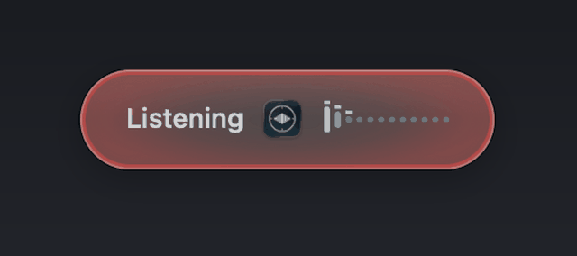

# Riffle

Local, private dictation for macOS. Hold a key, speak, release. Riffle
transcribes your voice on-device with Whisper, cleans it up with a local LLM,
and types the result into whatever field has focus.

No cloud. No subscription. No account. Audio and text never leave your Mac.



Riffle is a free alternative to subscription dictation tools like Wispr Flow,
built for people who want the same "speak messy, get clean text" experience
without sending their voice to someone else's servers.

## What the cleanup pass does

Raw speech-to-text gives you every "um", stutter, and false start. Riffle runs
the transcript through a small local LLM that:

- Removes fillers (um, uh, you know), stutters, and repeated words
- Applies self-corrections: "Tuesday, no wait, Wednesday" becomes "Wednesday"
- Fixes punctuation, capitalization, and homophones
- Honors spoken formatting: "new line", "new paragraph", "comma", "question mark"
- Writes numbers, times, emails, and URLs the way you would type them
  ("john at acme dot com" becomes "john@acme.com")
- Spells your names and jargon correctly via a custom dictionary
- Enforces exact spellings with deterministic word replacements applied
  after the LLM (brand casing, expansions like "btw" to "by the way")
- Adapts tone to the target app: chat apps get conversational text, email
  gets full sentences, terminals keep technical terms verbatim

If the LLM is unavailable, Riffle degrades gracefully and inserts the raw
Whisper transcript instead of failing.

## Example

Spoken:

> um so hey can you uh send me the the report by like tuesday no wait
> wednesday morning comma and also loop in john at acme dot com

Inserted:

> Hey, can you send me the report by Wednesday morning, and also loop in
> john@acme.com.

## Requirements

- Apple Silicon Mac (tested on M-series; fast on anything M1 or newer)
- macOS 13 or newer
- Xcode Command Line Tools (`xcode-select --install`)
- [Homebrew](https://brew.sh)
- Roughly 7 GB of disk for the two models, and 8 GB or more of RAM

## Install

```bash
git clone https://github.com/ThriveAdventures/riffle.git
cd riffle
scripts/setup.sh
```

The setup script installs whisper-cpp and Ollama through Homebrew, downloads
the Whisper model (`large-v3-turbo`, 1.6 GB) and the cleanup model
(`qwen2.5:7b`, 4.7 GB), builds the app, installs it to /Applications, and
launches it. Because you build it on your own machine, there are no Gatekeeper
warnings and nothing to notarize.

First launch asks for two permissions, both required:

1. Microphone: click OK on the system prompt
2. Accessibility: System Settings > Privacy & Security > Accessibility,
   toggle Riffle on (needed for the global hotkey and for pasting)

Two one-time checks:

- Quit any other dictation app (Wispr Flow and similar), they fight for the
  same hotkey
- macOS must not grab bare fn taps, or quick-tap hands-free mode opens
  the emoji picker and steals your paste. Either set System Settings >
  Keyboard > "Press fn key to" to "Do Nothing", or run:
  `defaults write com.apple.HIToolbox AppleFnUsageType -int 0`
  (already-running apps pick it up after a relaunch; revert with
  `defaults delete com.apple.HIToolbox AppleFnUsageType`)

## Using it

- Hold `fn`, speak, release: text lands at your cursor
- Quick-tap `fn`: hands-free mode, tap again to stop
- `esc` while recording: cancel
- You can start the next dictation while the previous one is still
  processing; results insert in the order you spoke them
- Menu bar icon shows state: waveform (idle), red dot (recording),
  hourglass (processing)
- A small HUD near the bottom of the screen shows live input level and status

### Meeting recording (macOS 14.2+)

Menu: Start meeting recording. Riffle captures your microphone and the
system audio (the other side of the call) as two tracks; the first use
asks for the System Audio Recording permission. Stop from the same menu
and Riffle transcribes both tracks with timestamps, labels them You and
Them, writes a local summary (TLDR, decisions, action items, notes), and
saves everything as markdown in ~/Documents/Meetings, opening it when
done. The menu bar mark turns blue while a meeting is recording. Long
meetings take a minute or two to process. Recording other people carries
consent obligations; announce it like you would any recording.

### Edit mode

Select text anywhere, hold `shift+fn`, and speak an instruction:

> "make this shorter" &nbsp; "turn this into bullets" &nbsp; "translate to French" &nbsp; "make it more formal"

The selection is replaced with the edited text. If the edit fails or nothing
is selected, your text is left untouched. Edit mode requires the local LLM
(it never falls back to pasting the raw instruction over your selection).

## Configuration

Config lives at `~/Library/Application Support/Riffle/config.json`
(menu: Open config file, then Reload config after editing).

| Key | Default | Notes |
| --- | --- | --- |
| `hotkey` | `fn` | `fn`, `right_command`, or `right_option` |
| `language` | `en` | Whisper language code, or `auto` for multilingual |
| `cleanup_enabled` | `true` | LLM pass on or off (also in the menu) |
| `cleanup_engine` | `ollama` | `ollama` or `apple` (Foundation Models on-device, macOS 26 with Apple Intelligence; also in the menu). Apple mode needs no downloads and frees the Ollama model's memory, with simpler cleanups |
| `llm_model` | `qwen2.5:7b` | any Ollama model tag |
| `dictionary` | examples | your names and jargon, spelled correctly |
| `replacements` | `[]` | forced find-and-replace after the LLM, e.g. `{"find": "btw", "replace": "by the way"}` (case-insensitive, whole-word) |
| `insert_mode` | `paste` | `paste` (cmd-v) or `type` (synthetic keystrokes) |
| `trailing_space` | `true` | append a space so you can keep dictating |
| `restore_clipboard` | `true` | put the old clipboard back after pasting |
| `sounds` | `true` | start and stop chimes |
| `history_enabled` | `true` | log dictations to history.jsonl |
| `fun` | `true` | occasional emoji in the HUD success flashes |
| `max_record_seconds` | `240` | hard stop for a single dictation |

Dictation history: `~/Library/Application Support/Riffle/history.jsonl`
(menu: Open history). Local only. Delete the file any time.

## How it works

```
hold fn -> AVAudioEngine records -> 16 kHz WAV
        -> whisper-server (large-v3-turbo, Metal, kept warm)
        -> Ollama cleanup with an app-aware prompt
        -> paste at cursor, restore clipboard
```

On an M-series Mac the whole pipeline typically lands text in about one
second: a few hundred milliseconds of transcription and a few hundred of
cleanup.

- The microphone engine is pre-warmed at launch and stays warm for a few
  seconds after each dictation, so speaking the instant you press the
  hotkey does not clip your first syllable (the orange mic indicator
  lingers for those few seconds accordingly)
- Riffle spawns and supervises `whisper-server` itself (port 12391) and
  shuts it down on quit
- Ollama runs as a Homebrew service; if it is not running, Riffle starts a
  temporary copy itself
- The LLM stays pinned in memory (`keep_alive: -1`) so cleanup stays fast
- Guardrails: if the LLM returns something suspicious (wrong length, meta
  commentary, answering instead of cleaning), Riffle falls back to the raw
  transcript for that dictation
- The cleanup prompt treats the transcript strictly as text to clean, never
  as instructions to follow

## Development

```bash
swift build -c release                       # build
scripts/build_app.sh                         # build + install to /Applications
.build/release/Riffle --selftest test.wav    # headless pipeline check
```

The app is plain Swift and AppKit, no dependencies, about a dozen small
files.

### Stable signing (grant permissions once)

macOS ties Accessibility grants to the app's code-signing identity. The
build script signs with a local certificate named "Riffle Local Signing"
when one exists in your keychain, so the grant survives rebuilds.
`setup.sh` creates the certificate automatically on first run; you approve
one trust dialog and never think about it again. The manual equivalent,
for reference:

```bash
openssl req -x509 -newkey rsa:2048 -keyout riffle-key.pem -out riffle-cert.pem \
  -days 3650 -nodes -subj "/CN=Riffle Local Signing" \
  -addext "keyUsage=digitalSignature" -addext "extendedKeyUsage=codeSigning" \
  -addext "basicConstraints=CA:FALSE"
openssl pkcs12 -export -legacy -out riffle.p12 -inkey riffle-key.pem \
  -in riffle-cert.pem -passout pass:rifflelocal
security import riffle.p12 -k ~/Library/Keychains/login.keychain-db \
  -P rifflelocal -T /usr/bin/codesign
security add-trusted-cert -p codeSign -k ~/Library/Keychains/login.keychain-db riffle-cert.pem
rm riffle-key.pem riffle.p12 riffle-cert.pem
```

Without it, builds fall back to ad-hoc signing and Accessibility must be
re-granted after every rebuild (the build script clears the stale entry
automatically in that case so the prompt is at least honest).

Logs: `~/Library/Application Support/Riffle/riffle.log` (app) and
`whisper-server.log` (transcription server).

## Troubleshooting

- Hotkey does nothing: Accessibility not granted, or another dictation app
  is holding the key. Check the menu bar dropdown for warnings.
- "AI cleanup: Ollama not reachable": `brew services start ollama`
- "AI cleanup: model missing": `ollama pull qwen2.5:7b`
- Transcription failed: check `whisper-server.log`; the app restarts the
  server automatically with backoff
- Paste lands nowhere: some secure fields (password boxes) block synthetic
  paste; that is macOS working as intended

## Uninstall

```bash
pkill -x Riffle
rm -rf /Applications/Riffle.app "$HOME/Library/Application Support/Riffle"
brew services stop ollama            # optional
brew uninstall whisper-cpp ollama    # optional
```

## Credits

Riffle stands on excellent open source work:
[whisper.cpp](https://github.com/ggml-org/whisper.cpp) (MIT),
OpenAI's [Whisper](https://github.com/openai/whisper) models (MIT),
[Ollama](https://github.com/ollama/ollama) (MIT), and Alibaba's
[Qwen2.5](https://github.com/QwenLM/Qwen2.5) models (Apache 2.0).

Built by [ThriveAI](https://thriveai.com). MIT licensed, see [LICENSE](LICENSE).
